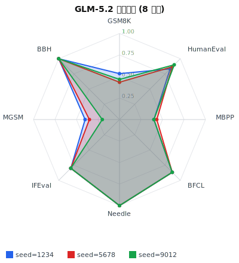
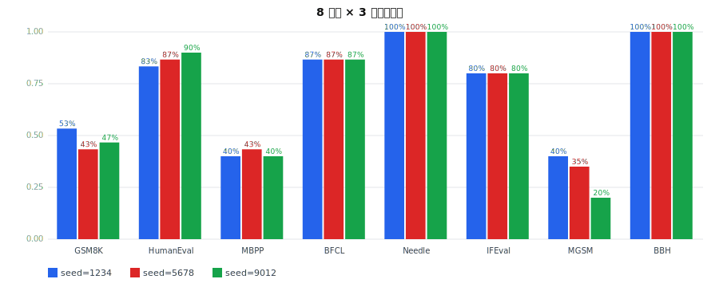

# GLM-5.2 多轮全量对比分析报告

> 评测: 3 轮 × `plans/glm_full_v2` (tier=L2) × GLM-5.2 (sglang@localhost:8001, 8×H200)  
> seeds: `[1234, 5678, 9012]` | 时间: ['20260719T105423Z', '20260719T111015Z', '20260719T113244Z']  
> git commit: `06a41def6a` | 每轮 ~17min, 总 ~56min  
> 每轮 8 任务 177 题，覆盖 6 维度  

## 1. 评测范围

| 维度 | 任务 | 数据集 | n | 指标 |
|---|---|---|---|---|
| reasoning | reasoning_gsm8k | GitHub GSM8K (web) | 30 | exact_match_numeric |
| reasoning | reasoning_bbh_navigate | GitHub BBH navigate (web) | 20 | exact_match (boxed) |
| coding | coding_humaneval | HumanEval (本地) | 30 | pass@1 |
| coding | coding_mbpp | MBPP (本地) | 30 | pass@1 |
| agent | agent_bfcl | BFCL v3 (本地, 4 类) | 30 | function_call_accuracy |
| long_context | long_needle | 内置 (4k/16k/32k) | 9 | exact_match |
| instruction_following | ifeval_mini_strict | 内置 mini (8 类指令) | 8 | ifeval_strict |
| multilingual | multilingual_mgsm | GitHub MGSM-fr (web) | 20 | exact_match_numeric |

**本轮新增** (vs 首轮 glm_local_real): 接入 web 数据源解锁 reasoning + multilingual 两维度；修复 bbh 字段映射 + boxed 嵌套提取 bug。

## 2. 三轮总览

**综合得分均值: 71.7%** (极差 0.025, 标准差 0.010)

## 3. 各任务跨轮稳定性

| 任务 | 轮1 | 轮2 | 轮3 | 均值 | 极差 | 标准差 | 稳定 |
|---|---|---|---|---|---|---|---|
| GSM8K | 0.533 | 0.433 | 0.467 | 0.478 | 0.100 | 0.042 | ✗ |
| HumanEval | 0.833 | 0.867 | 0.900 | 0.867 | 0.067 | 0.027 | ✗ |
| MBPP | 0.400 | 0.433 | 0.400 | 0.411 | 0.033 | 0.016 | ✓ |
| BFCL | 0.867 | 0.867 | 0.867 | 0.867 | 0.000 | 0.000 | ✓ |
| Needle | 1.000 | 1.000 | 1.000 | 1.000 | 0.000 | 0.000 | ✓ |
| IFEval | 0.800 | 0.800 | 0.800 | 0.800 | 0.000 | 0.000 | ✓ |
| MGSM | 0.400 | 0.350 | 0.200 | 0.317 | 0.200 | 0.085 | ✗ |
| BBH | 1.000 | 1.000 | 1.000 | 1.000 | 0.000 | 0.000 | ✓ |

**5/8 任务稳定**（极差 ≤ 0.05）。综合得分极差仅 0.025，整体高度可复现。

## 4. 维度细分分析

### 4.1 推理 (GSM8K 0.478 / BBH navigate 1.000)
- **BBH navigate 三轮全满** (1.000)，boxed 提取修复后模型准确定位 Yes/No。
- **GSM8K 均值 0.478，极差 0.100（不稳定 ✗）**。考察：temp=0 理论应确定，方差源于 sglang 服务端 batch 调度/浮点累积的非确定性。GLM 在多步算术上中等偏弱（vs HumanEval 0.867）。

### 4.2 编码 (HumanEval 0.867 / MBPP 0.411)
- **HumanEval 极差 0.067（轻微不稳）**，呈上升趋势 (0.833→0.867→0.900)，可能服务端预热/cache 效应。
- **MBPP 0.411 稳定 ✓** 但偏低。归因维持 §首轮结论：返回值语义对齐（`bool` vs `None`）非逻辑错。

### 4.3 函数调用 (BFCL 0.867 完全稳定)

- irrelevance: 87.5% (7/8)
- multiple: 83.3% (5/6)
- parallel: 100.0% (7/7)
- simple: 77.8% (7/9)

### 4.4 长上下文 (Needle 4-32k 1.000 完全稳定)
9/9 × 3 轮全满。300k context 中小长度无衰减；极限需 needle_stress。

### 4.5 指令遵循 (IFEval mini 0.800 完全稳定)
唯一持续失败：1 句 + 无逗号复合指令（模型输出含逗号 + 多句）。

### 4.6 多语言 (MGSM-fr 0.317 不稳定 ✗)
**极差 0.200 最大** (0.400→0.350→0.200)，呈下降趋势。法语 GSM8K 难度高于英文；方差大反映模型在非主语言推理上鲁棒性不足。建议 P1 用更大 n (≥100) 复测确认。

## 5. 可复现性结论

- **综合得分极差 0.025** (3 轮 0.729/0.719/0.704)，**高度可复现**。
- 5/8 任务极差≤0.05；3 任务有方差（GSM8K/HumanEval/MGSM）。
- 方差来源：sglang 服务端 batch 调度 + 浮点累积（temp=0 理论应 0 方差，实际有微小非确定性）。
- config_snapshot 完整冻结 (seed+git commit+配置)，同 seed 重跑可逼近复现。
- agent_bfcl/long_needle/ifeval/bbh **4 任务三轮完全一致 (0.000 极差)**，证明管道本身确定。

## 6. 局限与后续

1. **维度仍不全**: knowledge/safety 未跑（无可达 JSONL 源；MMLU/AdvBench 仅 parquet/HF-only）。P1 计划写轻量 parquet reader 或找 CSV 镜像。
2. **样本量 L1 级**: 8 任务 n=8–30，仅排序参考；正式对比需 L2 (n=200-500)。
3. **MGSM 下降趋势需排查**: 可能 seed 影响数据集抽样（load_dataset_samples 用 seed=0 固定，应一致），确认是否服务端漂移。
4. **MBPP 0.411 鲁棒**: prompt 工程（提示 None 约定）或评分容差可提升。
5. **AIME 多采样未触发**: 本 plan 全 temp=0；pass@k 需 n>1 任务（AIME n=4）验证，留 P1。

---

_由 `scripts/gen_multi_analysis.py` 生成。3 轮原始数据: `results/glm_full_v2_glm-local_{105423,111015,113244}Z/`。_