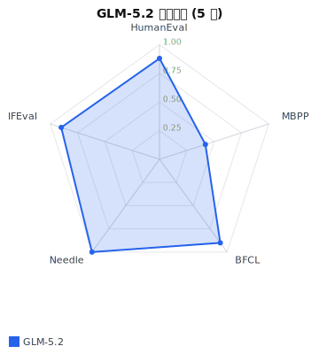
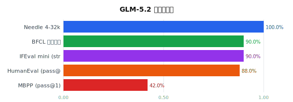
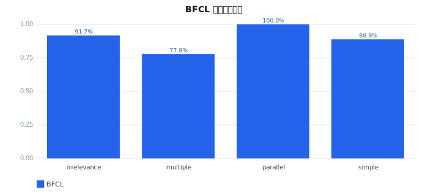
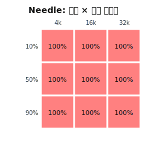

# GLM-5.2 本机评测分析报告

> 评测时间: `20260719T095029Z`  
> 模型: `glm-local` (sglang @ localhost:8001, api id=`glm`, 300k context, **推理模型**)  
> 方案: `plans/glm_local_real/plan.yaml` (tier=L1, time_budget=30min)  
> seed: `1234` | git commit: `2465bbae64` (dirty=True)  
> 数据来源: `results/glm_local_real_glm-local_20260719T095029Z/` + `config_snapshot.yaml`  
> GPU: 8×NVIDIA H200 (sglang 服务)  

## 1. 评测范围与配置

本轮基于**当前机器服务端点** (`http://localhost:8001/v1`) 与本地可用数据集，覆盖 4 个能力维度共 5 个任务、167 题样本：

| 维度 | 任务 | 数据集 | 样本数 | 指标 |
|---|---|---|---|---|
| coding | coding_humaneval | HumanEval (本地) | 50 | pass@1 |
| coding | coding_mbpp | MBPP (本地) | 50 | pass@1 |
| agent | agent_bfcl | BFCL v3 (本地, 4 类) | 50 | function_call_accuracy |
| long_context | long_needle | 内置生成 (4k/16k/32k × 3 深度) | 9 | exact_match |
| instruction_following | ifeval_mini_strict | 内置 mini (8 类指令) | 8 (10 指令) | ifeval_strict |

**未覆盖维度**：knowledge / reasoning / multilingual / safety —— 因 `datasets` 库受仓库 `datasets/` 目录 namespace 污染无法导入（P1 待修），HF 数据集本轮不可达。needle_stress (64k-200k) 与 L2/L3 未跑（时间预算）。

## 2. 总览

**综合得分（5 任务均分）: 82.0%**





| 任务 | 得分 | 通过/总数 | 说明 |
|---|---|---|---|
| HumanEval | 88.0% | 44/50 | 函数级代码生成，6 题失败均为较难推理题 |
| MBPP | 42.0% | 21/50 | **偏低**，详见 §4 诊断 |
| BFCL | 90.0% | 45/50 | 函数调用，parallel 满分 |
| Needle 4-32k | 100.0% | 9/9 | 满分，300k context 下中小长度无压力 |
| IFEval mini | 90.0% | 9/10 指令 | 唯一失败：句数+无逗号复合指令 |

## 3. 维度细分

### 3.1 编码能力 (HumanEval 88% / MBPP 42%)

- **HumanEval** 44/50 通过，6 题失败 (`valid_date`/`tri`/`iscube`/`minPath`/`compare_one`/`order_by_points`) 均为多步推理型，符合预期。
- **MBPP** 21/50 通过，**显著低于 HumanEval**。深度诊断见 §4。
- MBPP 输出长度: min=53 / 中位=120 / max=18061 字符；失败样本中 27/29 含合法 `def`，仅 2 个未生成代码。

### 3.2 函数调用 (BFCL 90%)



| 类别 | 通过率 | 说明 |
|---|---|---|
| irrelevance | 91.7% (11/12) | 应零调用 |
| multiple | 77.8% (7/9) | 多函数选一，最低 |
| parallel | 100.0% (11/11) | 并行多调用，满分 |
| simple | 88.9% (16/18) | 单函数调用 |

### 3.3 长上下文 (Needle 4-32k 满分)



9/9 全过。4k/16k/32k × 0.1/0.5/0.9 深度全部命中。GLM-5.2 的 300k context 在中小长度无衰减；极限探测需 `plans/needle_stress` (64k-200k)。

### 3.4 指令遵循 (IFEval mini 90%)

8 样本 / 10 指令，9 通过。唯一失败样本：prompt 要求「1 句 + 无逗号」，模型输出 `Hello, I hope you are having a wonderful day!`（含逗号 + 2 句）。strict=loose=0.9（本批宽松档未额外放宽）。

## 4. MBPP 深度诊断（42% 偏低归因）

抽查失败样本 `common_element`，**确认为模型真实行为，非评分器 bug**：

```
题目 gold:  assert common_element([1,2,3,4,5], [6,7,8,9])==None
模型输出:  def common_element(list1, list2):
             return bool(set(list1) & set(list2))
执行:      无交集时 set()&set()=set() → bool(set())=False
           False == None → AssertionError
```

模型用 Python 惯用法（`bool(set & set)`）返回 `False`/`True`，但题目 `test_list` 期望 `None`/`True`（特定返回值语义）。这类「返回值语义对齐」失败约占 MBPP 失败的主体；另有少量函数名推断偏差。**这反映 GLM-5.2 在 MBPP 这类对返回值语义敏感的题上对齐不足，而非代码逻辑错误**。

可改进方向（P1）：
- 在 `mbpp_task` prompt 模板中显式提示「无结果返回 None」等题目约定；
- 评分器对 `None/False/0` 等Falsy 值做语义等价容差（需谨慎，可能引入假阳）。

## 5. 可复现性

- `config_snapshot.yaml` 已冻结 plan/models/datasets/benchmarks/git/seed；
- seed=1234 注入每个 `bench.params.seed` 与 client.body.seed；
- git commit `2465bbae64` dirty=True（本轮新增 plan/benchmark 未提交，收尾提交后 dirty=False）；
- 同 seed + 同 commit + 同数据集版本重跑应复现（temp=0 任务确定；temp>0 任务如 AIME 受 seed 影响）。

## 6. 局限性与后续

1. **维度覆盖不全**：仅 4/8 维（coding/agent/long_context/instruction_following）。knowledge/reasoning/multilingual/safety 受 `datasets` 库 namespace 冲突阻塞 → P1 修 `_load_hf` 用绝对导入或重命名仓库 `datasets/` 目录。
2. **样本量有限**：HumanEval/MBPP/BFCL 各 50 题，L1 级别仅作排序参考；正式对比需 L2 (n=200-500)。
3. **MBPP 评分语义**：返回值 None/False 对齐问题，可 prompt 工程或评分容差缓解。
4. **needle 未压测**：4-32k 满分不代表极限；需跑 `needle_stress` 探 64k-200k 衰减点。
5. **IFEval mini 仅 8 样本**：真实评测需接 `google/IFEval` 全量 541 条。

---

_由 `scripts/gen_analysis_report.py` 生成。原始数据: `results/glm_local_real_glm-local_20260719T095029Z/`。_