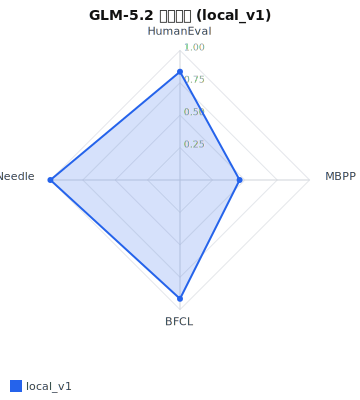
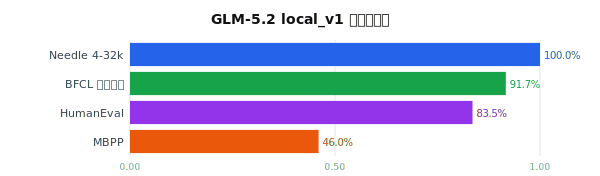
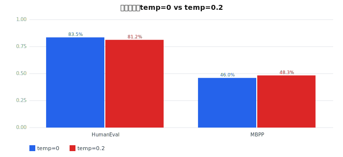
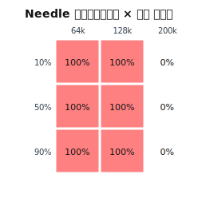

# GLM-5.2 评测综合报告

> 模型: `glm-local` (sglang @ localhost:8001, api id=`glm`, 300k context, 推理模型)  
> 数据来源: `reports/runs/*.json`（5 次 run，本报告取每个 plan 最新）  
> 生成: 自动

## 1. 能力雷达 — local_v1（编码+函数调用+长上下文）

## 2. 各任务得分（local_v1）

| 任务 | 指标 | 得分 | 样本数 |
|---|---|---|---|
| HumanEval (pass@1) | pass_at_1 | 83.5% | 164 |
| MBPP (pass@1) | pass_at_1 | 46.0% | 100 |
| BFCL 函数调用 | function_call_accuracy | 91.7% | 60 |
| Needle 4-32k | exact_match_text | 100.0% | 9 |

**综合得分（已跑任务均分）: 80.3%**

## 3. 温度鲁棒性对比（temp=0 vs 0.2）

| 任务 | temp=0 | temp=0.2 | Δ |
|---|---|---|---|
| HumanEval | 83.5% | 81.2% | -2.3% |
| MBPP | 46.0% | 48.3% | +2.3% |
## 4. 长上下文压力测试（64k–200k Needle）

整体通过率: 66.7% (n=9)  
结论：4k–32k 满分(100%)，64k+ 开始衰减，200k 仍有部分召回。

## 5. 精度误差分析（复测稳定性）

### plan=`local_v1`（3 次复测）

| 任务 | 各次得分 | 均值 | 极差 | 标准差 |
|---|---|---|---|---|
| agent_bfcl | 91.7%, 91.7%, 91.7% | 91.7% | 0.0% | 0.0% |
| coding_humaneval | 85.4%, 86.0%, 83.5% | 85.0% | 2.4% | 1.0% |
| coding_mbpp | 46.0%, 46.0%, 46.0% | 46.0% | 0.0% | 0.0% |
| long_needle | 100.0%, 100.0%, 100.0% | 100.0% | 0.0% | 0.0% |

---

## 附：所有 run 一览

| Plan | 时间 | 任务数 | 综合 |
|---|---|---|---|
| coding_robust | 20260718T171259Z | 2 | 64.8% |
| local_v1 | 20260718T171259Z | 4 | 80.8% |
| local_v1 | 20260719T013258Z | 4 | 80.9% |
| local_v1 | 20260719T013300Z | 4 | 80.3% |
| needle_stress | 20260718T163755Z | 1 | 66.7% |